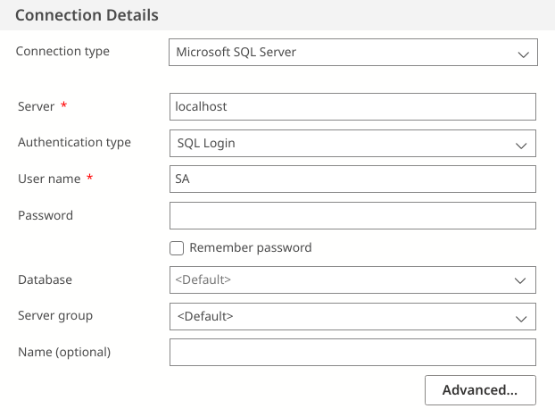

:::tip
本文翻译自：[Microsoft SQL Server on Arch Linux](https://www.deanthomson.com/blog/microsoft-sql-server-on-arch-linux/)
参考文档：[SQL Docs/SQL Server on Linux](https://docs.microsoft.com/en-us/sql/linux/)
:::
# 一、安装基础软件包
- mssql-server – this is for the main MS SQL Server installation
- msodbcsql – this is for connecting to MS SQL Server
- mssql-tools – these are the command line tools for interacting with MS SQL Server
可以直接使用AUR Helper(如yay)从AUR下安装，也可以按照原文[Microsoft SQL Server on Arch Linux](https://www.deanthomson.com/blog/microsoft-sql-server-on-arch-linux/)中自行make
```bash
yay -S mssql-server msodbcsql mssql-tools
```

安装完成后，确保mssql-server.service为打开状态
1. 可以通过status参数查看状态
```bash
systemctl status mssql-server.service
```
2. 如果状态为“inactive (dead)”，打开服务
```bash
systemctl enable --now mssql-server.service # 打开并设置开机启动
systemctl start mssql-server.service        # 只打开
```
# 二、SQL Server初始化设置
这一部分我们需要对SQL Server进行初始化设置，包括设置SA密码，选择安装版本，设置语言

我们可以调用mssql-conf，整个配置过程将非常方便且迅速  
1. 使用--help参数获取基本用法介绍
```bash
/opt/mssql/bin/mssql-conf --help 
##原文中的版本为：/opt/mssql/bin/mssql-config --help，经过测试不使用本文档
```
2. 运行配置程序
```bash
/opt/mssql/bin/mssql-conf setup
```
# Azure Data Studio
## 安装
不幸的是微软没有提供Linux版本的SQL Server Management Studio，但我们可以使用替代品Azure Data Studio。

Azure Data Studio是基于Microsoft Visual Studio Code editor的一个数据库管理工具，具有对SQL Server完全的交互功能，但相比SQL Server Management Studio少了菜单上的向导

Azure Data Studio同样可以直接从AUR上安装

```bash
yay -S azuredatastudio-bin
```
## 连接本地SQL实例
- 如图所示进行配置  
Server填入localhost或者主机IP  
User name填入SA（数据库管理员）  
Password填入刚刚初始化时设置的密码  


## 开始学习吧！
[Azure Data Studio文档](https://docs.microsoft.com/zh-cn/sql/azure-data-studio/?view=sql-server-ver15)