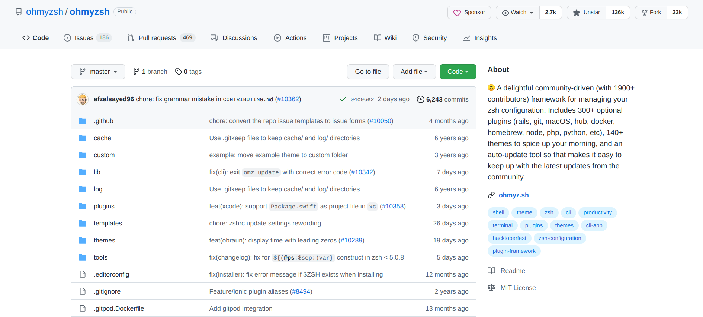

## zsh&oh-my-zsh配置

### 为什么要使用zsh？

- 功能强大插件
- 丰富酷炫的主题
- 对bash完全兼容，这意味着与bash语法一致
- 功能更“健全”的Tab补全
- 代码高亮
- .......

相信你在阅读完本文以及用上zsh一段时间过后之后(可能并不需要很久)，能对以上几点有所体会。

### oh-my-zsh是什么？


oh-my-zsh是github下一个社区驱动的开源项目，目前在github已有136k的star，通过oh-my-zsh，你能更轻易地进行配置zsh以及对zsh插件的管理。



### 上手使用zsh&oh-my-zsh

1. **下载zsh**

   - Ubuntu/Debian/...：``sudo apt-get install zsh``
   - CentOS/RedHat/...：``sudo yum install -y zsh``
   - Archlinux/Manjaro/...:`` sudo pacman -S zsh``
2. **安装oh-my-zsh**

   ```shell
   sh -c "$(curl -fsSL https://raw.github.com/ohmyzsh/ohmyzsh/master/tools/install.sh)"
   ```
3. **基本配置(~/.zshrc)**

   ```shell
   #编辑.zshrc文件
   cd | vim .zshrc
   ```

   1. 修改主题

      前往 [ohmyzshWikiThemes](https://github.com/ohmyzsh/ohmyzsh/wiki/Themes) 获取想要的主题

      在.zshrc文件中找到 ``ZSH_THEME="agnoster"`` 一行进行编辑

      ```shell
      #默认主题
      #ZSH_THEME="robbyrussell"
      #更改为在上述wiki页面中心仪的主题，如我个人用的agnoster
      ZSH_THEME="agnoster"
      ```
   2. 添加插件

      - 另开一个终端，安装两个第三方插件

        zsh-autosuggestions插件，自动匹配之前输入过的命令，懒人必备

        ```bash
        git clone https://github.com/zsh-users/zsh-autosuggestions ${ZSH_CUSTOM:-~/.oh-my-zsh/custom}/plugins/zsh-autosuggestions
        ```

        zsh-syntax-highlighting插件，会将输错的命令用红色字体高亮显示

        ```shell
        git clone https://github.com/zsh-users/zsh-syntax-highlighting.git ${ZSH_CUSTOM:-~/.oh-my-zsh/custom}/plugins/zsh-syntax-highlighting
        ```

      接着修改.zshrc文件中的plugins配置

      ```shell
      plugins=(
      	git       #git相关的命令别名
      	sudo      #连续按两下Esc在本行命令最前方添加sudo，很方便
      	zsh-syntax-highlighting 
      	zsh-autosuggestions
        archlinux #archlinux下相关的命令别名(pacman,AUR Helper)
        colored-man-pages #对man页面使用语法高亮，便于查看
      )
      ```

### Just enjoy！
