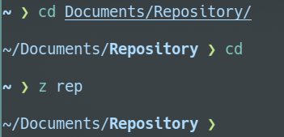

## 相比于oh-my-fish
相比于oh-my-fish，fisher最突出的优点就在于轻量级，并且不那么具有“破坏性”，oh-my-fish会让fish的配置文件变得繁琐(如新产生的init.fish文件)    
而fisher在实现oh-my-fish几乎所有功能的同时不改变fish原有的配置目录结构

## 安装
### fish与fisher
> 参考[fisher](https://github.com/jorgebucaran/fisher)
```shell
sudo pacman -S fish
curl -sL https://git.io/fisher | source && fisher install jorgebucaran/fisher
```

### 更改默认shell

```shell
chsh -l               //列出可用shell
chsh -s /bin/fish     //设置shell为/bin/fish
```
chsh设置的是命令行终端下的默认shell，使用图形化界面的用户应当同步更改终端模拟器(如kde的konsole)的配置方案


## 基本配置
> 更多插件参考[awsm.fish](https://github.com/jorgebucaran/awsm.fish)
安装完成后，可以发现和默认的fish似乎没什么区别，这是正常的，毕竟fisher只是个插件管理工具，下面介绍几个常用的插件
### 更改外观与配色[Prompts]
#### tide
```
fisher install IlanCosman/tide@v5
```
命令行输入```tide configure```，根据提示选择即可完成配置，整个过程就像是填一份问卷
### nvm
nvm是一个node版本管理与切换的工具，我们可直接以fisher插件的形式使用，支持.nvmrc，功能简单而强大，使用说明参考：[nvm.fish](https://github.com/jorgebucaran/nvm.fish)
```
fisher install jorgebucaran/nvm.fish
```
### z
一个快速切换常用目录的工具。使用```z [keyword]```可匹配最近切换过的目录
```
fisher install jethrokuan/z
```
就像这样  


### Done
一个非常有意思的插件，他会在命令执行完毕之后发送一条通知
```
fisher install franciscolourenco/done
```
### autopair
他能帮你自动补上右括号
```
fisher install jorgebucaran/autopair.fish
```

### Abbreviation Tips
如果你有在```~/.config/fish/config.fish```之中使用abbr配置别名(类似alias，但会显示原本的命令)，他会在你使用原本命令的情况下提示有可替代的别名
```
fisher install gazorby/fish-abbreviation-tips
```


