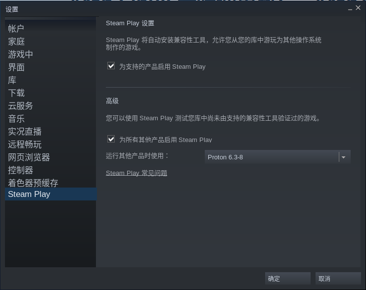
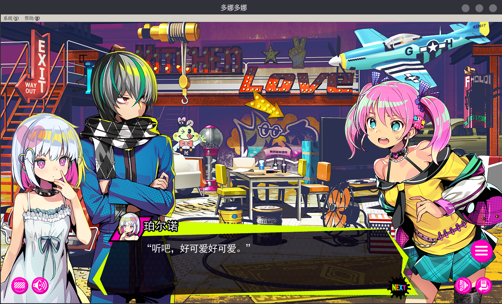

## 一、SteamPlay
> [官方文档](https://wiki.archlinux.org/title/Steam_(%E7%AE%80%E4%BD%93%E4%B8%AD%E6%96%87))
1. 启用Proton：在设置>Steam Play中将“为支持的产品启用Steam Play”与“为其他产品启用Steam Play”两个Check Box勾选即可，Proton版本选择最新的正式版(如Proton 6.3-8)即可

2. 在[ProtonDB](https://www.protondb.com/)上查看游戏使用Proton的运行情况，黄金以上评级即可玩，同时可以留意评论区，会有大佬提供一些启动参数，可能解决一些问题。
## 二、EPIC
推荐使用开箱即用的[Heroic](https://github.com/Heroic-Games-Launcher/HeroicGamesLauncher)，与Proton共用一个数据库
## 三、Wine
一般把字体问题解决了就可以玩一些GalGame了  
我复制Proton的字体(```~/.local/share/Steam/steamapps/common/Proton 6.3/dist/share/fonts/```)到```/usr/share/wine/fonts/```之后，成功运行了**Mirror**与**多娜多娜**，比之前开虚拟机玩舒服多了

## 四、Lutris
不多介绍了


