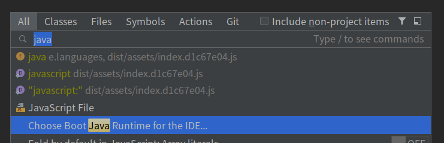
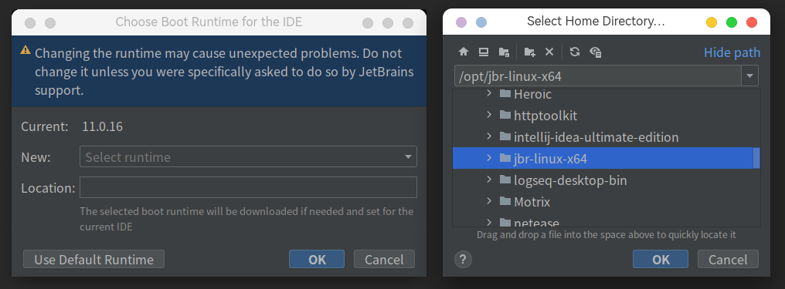

# 默认Java Runtime存在的问题

- fcitx 输入法候选框不跟随光标
- Markdown 文件无法正常预览
- emoji无法正常显示
- .......

## 解决方案

### 速通版(Archlinux)

**1. 从AUR下载[JetBrainsRuntime-for-Linux-x64](https://aur.archlinux.org/packages/jbr-linux-x64)**

```shell
yay -S jbr-linux-x64
# or
paru -S jbr-linux-x64
```

**2. 为IDE指定Boot Java Runtime**

大部分的CSDN上的教程都采用直接覆盖默认的Java Runtime目录，但实际上有更简单保险的操作  
在IDE中打开一个项目，双击```Shift```打开搜索面板，输入```java```搜索

将Java Runtime改为```/opt/jbr-linux-x64```即可  


### 其他Linux发行版

**1. 从Github下载[JetBrainsRuntime-for-Linux-x64](https://github.com/RikudouPatrickstar/JetBrainsRuntime-for-Linux-x64)**

下载release里的最新jbr-linux-x64压缩包文件

**2. 为IDE指定Boot Java Runtime**

方法同上，只是目录变更为你的下载或解压位置