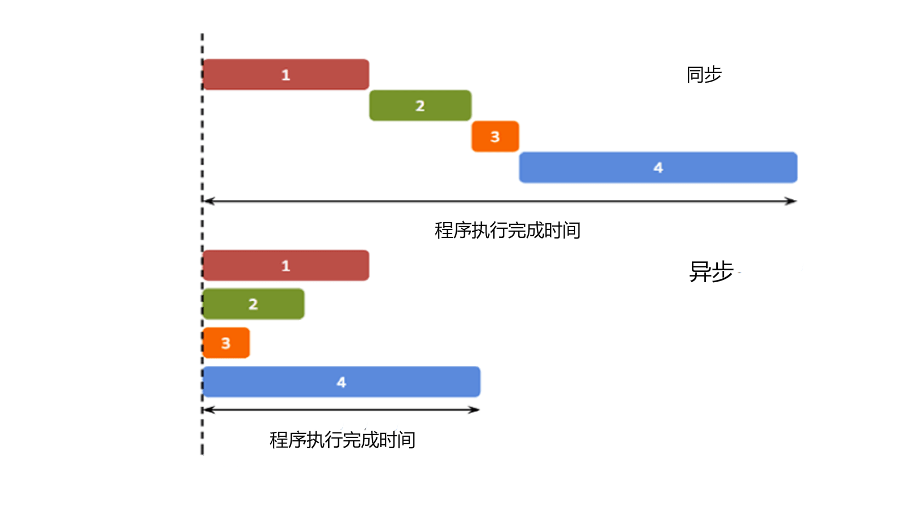
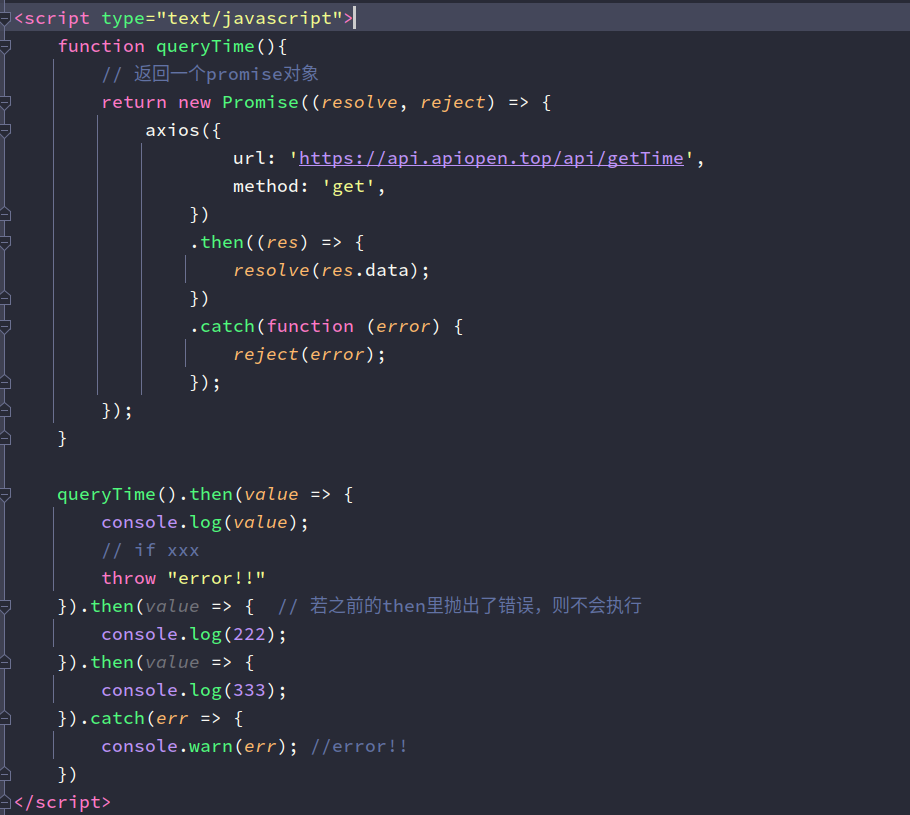
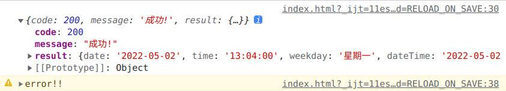
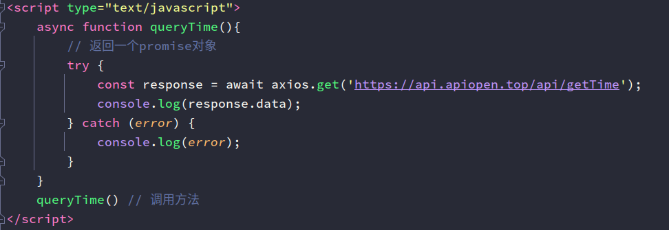
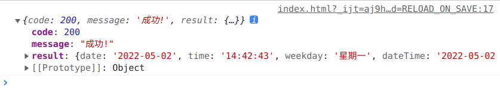

> 参考：[JavaScript Promises(Web.dev)](https://web.dev/promises/#whats-all-the-fuss-about)

## **异步的概念**

异步（Asynchronous, async）是与同步（Synchronous, sync）相对的概念。


## **Promise 对象与 API**

### **1. Promise 的状态「PromiseState」**

对象的状态不受外界影响。Promise 对象代表一个异步操作，有三种状态
* **pending**: 初始状态，不是成功或失败状态。
* **resolved/fulfilled**: 意味着操作成功完成。
* **rejected**: 意味着操作失败。

状态只会有以下两种变换，且一个promise对象只能改变一次
1. pending 变为 resolved
2. pending 变为 rejected


### **2. Promise 对象的值「PromiseResult」**

保存着异步任务成功/失败的结果(返回值)

### **3. 创建 Promise 对象**

```javascript
// 创建promise对象
var promise = new Promise(function(resolve, reject) {
  // 异步处理
  if (/* 完成处理 */) {
    resolve("Stuff worked!");     // 调用resolve
  }else {
    reject(Error("It broke"));    // 调用reject
  }
});
```

### **4. 为 Promise 对象添加回调**

对于已经实例化过的 promise 对象可以调用 promise.then() 方法，传递 resolve 和 reject 方法作为回调
promise.then() 是 promise 最为常用的方法。
```javascript
promise.then(onFulfilled, onRejected)     
promise.then(onFulfilled).catch(onRejected)
```


```javascript
promise.then(function(result) {
  console.log(result); // resolve回调函数
}, function(err) {
  console.log(err); // reject回调函数
});
```

### **5. Promised.resolve()**

可以传入一个东西(参数)，返回一个promise对象
1. 如果传了一个值，将它封装为成功的promise对象
2. 如果传入了一个promise对象，则根据这个promise对象是否成功，返回成功/失败的promise对象

### **6. Promise.reject()**

可以传入一个东西(参数)，返回一个**失败的**promise对象

### **7. Promise.all()**

可以传入一个promise数组，返回他们的结果数组  
如果promise数组里的对象都成功，则为成功  

```javascript
let p1 = Promise.resolve("Success")
let p2 = Promise.resolve("OK")
let p3 = Promise.resolve("Yes")
const results = Promise.all([p1,p2,p3])
```
> 例如：一些场景下上传图片需要一张一张传，但你需要同时确保所有图片都上传成功后再执行某项操作，这时候要想起来“Promise.all()”
### **8. Promise.race()**

可以传入一个promise数组，返回最快完成的promise的结果


## **Promise 链式调用**

由于then的返回结果也是一个promise对象，因此可以链式调用.then 方法，串联多个任务

### **异常穿透**

```javascript
promise.then(value => {
  console.log(111); 
  // if xxx
  throw "error!!"
}).then(value => {  // 若之前的then里抛出了错误，则不会执行
  console.log(222); 
}).then(value => {
  console.log(333); 
}).catch(err => {
  console.warn(err); //error!!
})
```


### **中断 promise 链**

一些情况下我们需要直接中断调用链，之后的 .then 与 .catch 都不执行，我们需要可以 return 一个pending状态的 promise对象，而 .then 与 .catch 是在状态改变之后才会调用的。

```javascript
promise.then(value => {
  console.log(111); 
  // if xxx
  return new Promise(() => {});
}).then(value => {  // 若之前的then里return了pending状态的promise对象，则不会执行下面的代码
  console.log(222); 
}).then(value => {
  console.log(333); 
}).catch(err => {
  console.warn(err); 
})
```

## **async 与 await**

### **async 函数**

> 这是来自MDN的对 async函数的说明：async函数是使用async关键字声明的函数。 async函数是AsyncFunction构造函数的实例， 并且其中允许使用await关键字。async和await关键字让我们可以用一种更简洁的方式写出基于Promise的异步行为，而无需刻意地链式调用promise。
1. 函数的返回值为 promise 对象（thenable）
2. promise 对象的结果由 async 函数执行的返回值决定

### **await 表达式**

1. await 右侧的表达式一般为 promise 对象，但也可以是其他的值
2. 如果表达式是 promise 对象，await 返回的是 promise 成功的值
3. 如果表达式是其他值，直接将此值作为 await 的返回值

**注意：**   
1. await 必须写在 async 函数中，但 async 中可以没有 await
2. 如果 await 的 promise 失败了，就会抛出异常，需要通过try...catch...捕获处理

## **示例**

### promise 发送axios请求

**代码：**  

**浏览器终端输出：**  


### async 与 await 发送axios请求

**代码：**  

**浏览器终端输出：**  
