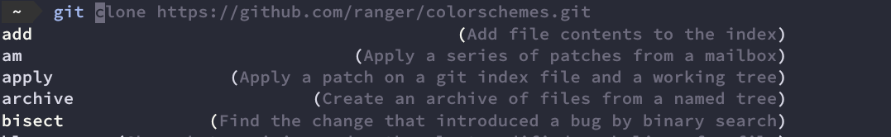
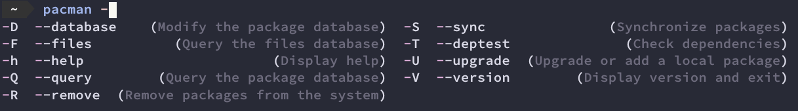
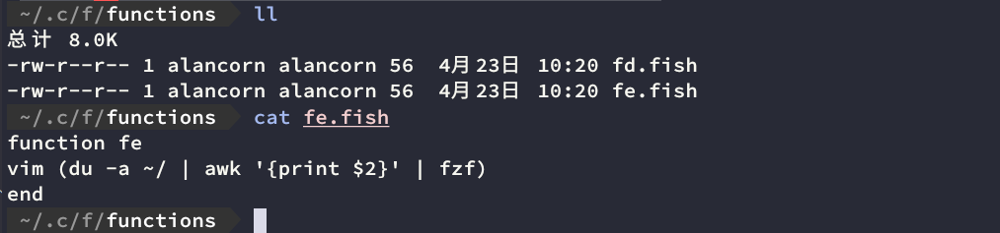
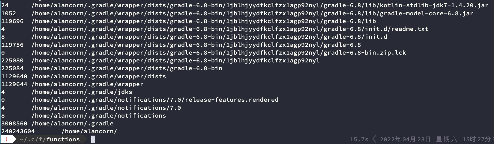
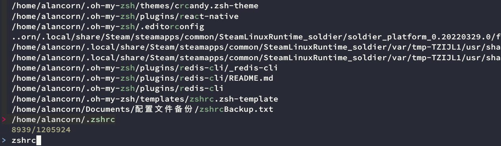
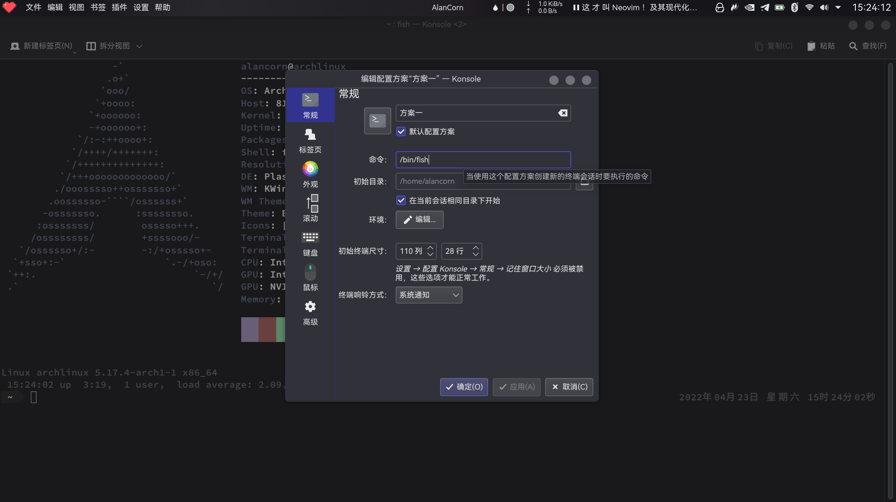
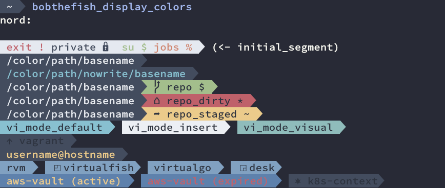
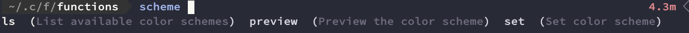
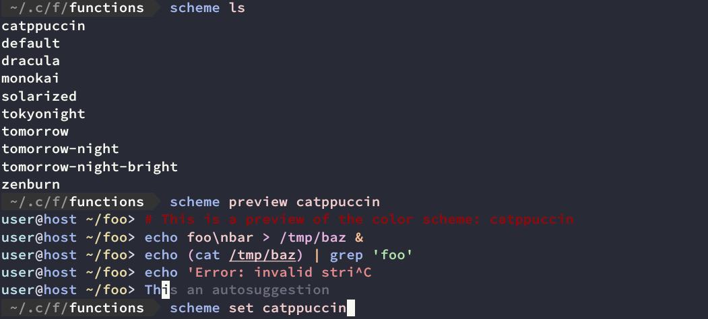

## fish的优点

优点方面感觉说一大堆也没啥用，不如自己尝试一下看看  
对我而言，fish吸引的地方是他的**默认配置**已经足够**易用**，后续只需修改主题与颜色方案就是一个很不错的shell  
以下是fish吸引我从zsh转换到fish的优点
* **更强大的命令补全与选项补全，你可以查看不同命令与选项的作用**


* **更加简单易用的fish脚本（~/.config/fish/functions）**  
这是我今天折腾fish的**直接原因**  
在观看了[fzf小技巧，dwm键位绑定以及neofetch](https://www.bilibili.com/video/BV1cu41117d9)这一个视频之后，我才了解到fish下可以通过将不同命令组合的方式来形成新的命令(视频中的fe通过将fzf、awk、du、vim组合，实现了查找/home下的所有文件，并通过vim打开)  
一开始我以为通过alias命令别名也能实现类似的效果，于是我将它改成了bash的语法，在.zshrc中写了一条命令别名
```shell
// ~/.zshrc
alias fe="vim `du -a ~/ | awk '{print $2}' | fzf`"
```
但是我忘记了反引号在bash中会被当作命令执行，将这条命令写入zsh启动脚本.zshrc  
这就导致最终的效果成了在zsh启动的时候就 反引号内的命令就被执行了，fe这条命令别名中，vim打开的文件就是静态的了  
之后也尝试寻找了其他方案，但总感觉不如fish来得优雅与方便  
> 在fish下只需要在```~/.config/fish/functions```目录下创建fe.fish即可实现  
> 不仅便于管理，而且上手简单，只需要很少的基础就能定制一些属于自己的命令


> **fe的实现原理**  
> 1. ```du -a ~/```检索检索```/home```目录下所有文件  
> 如图为```du -a ~/```的执行结果，但我们需要的只是第二列，因此通过管道传送给```awk '{print $2}'```，将第二列提取出来
> 
> 2. 接着通过管道把家目录下的所有文件名都丢给```fzf```，```fzf```是一个实时的交互式的模糊搜索工具
> 
> 3. 通过方向键选择文件，将文件名返回给vim即可打开  
> **fe的视频演示效果**
> 时间：0:38 [fzf小技巧，dwm键位绑定以及neofetch](https://www.bilibili.com/video/BV1cu41117d9)
* 缺点  
可能只有语法与bash不同这一点，但某种意义上来说可能也是优点，fish的语法实际上比bash的语法更加“现代”，而且容易上手

## fish&oh-my-fish

### 安装fish与oh-my-fish
> 配合官方文档[oh-my-fish](https://github.com/oh-my-fish/oh-my-fish#installation)食用更佳
```shell
sudo pacman -S fish
curl https://raw.githubusercontent.com/oh-my-fish/oh-my-fish/master/bin/install | fish
```

### 更改默认shell

```shell
chsh -l               //列出可用shell
chsh -s /bin/fish     //设置shell为/bin/fish
```
chsh设置的是命令行终端下的默认shell，使用图形化界面的用户应当同步更改终端模拟器(如kde的konsole)的配置方案

### 配置theme与color-scheme

1. 使用[omf](https://github.com/oh-my-fish/oh-my-fish#installation)配置theme
个人比较喜欢[bobthefish](https://github.com/oh-my-fish/oh-my-fish/blob/master/docs/Themes.md#bobthefish)这一个主题，可以配置的东西很多，也可以更改颜色主题方案
```shell
omz theme               // 列出可用的theme
omz install bobthefish  // 安装bobthefish主题
omz theme bobthefish    //使用bobthefish主题
```
使用bobthefish主题可能会遇到一些字符错乱问题，请查阅[bobthefish](https://github.com/oh-my-fish/oh-my-fish/blob/master/docs/Themes.md#bobthefish)文档
> 若采用了bobthefish主题，可以照着我的方案继续配置
* bobthefish提供了多种Color scheme options，如：```dark```、```ligh```、```solarized```、```base16```、```zenburn```、```gruvbox```、```dracula```、```nord```
```shell
set theme_color_scheme nord     //设置 color_scheme 为node
```
你可以通过下面这条命令查看该color_scheme在你的终端模拟器下的显示效果
```shell
bobthefish_display_colors
```

2. 使用[fish-color-scheme-switcher](https://github.com/h-matsuo/fish-color-scheme-switcher)配置color-scheme

这里的color-scheme指的是在输入命令的时候的高亮颜色方案，我觉得fish默认的color-scheme与我的终端模拟器搭配起来可读性很差，于是想要更改为可读性与美观性更高的color-scheme  
* **安装**
由于我们使用了omf,直接通过omf安装即可
```shell
omf install https://github.com/h-matsuo/fish-color-scheme-switcher
omf reload
```
* **使用方式**
fish环境下的tab键足以获取使用方法与说明

```shell
scheme ls                   //列出可用color-scheme
scheme preview catppuccin   //预览catppuccin这一个方案
scheme set catppuccin       //设置 color_scheme
```


至此，你已经得到了一个足够强大与美观的fish shell