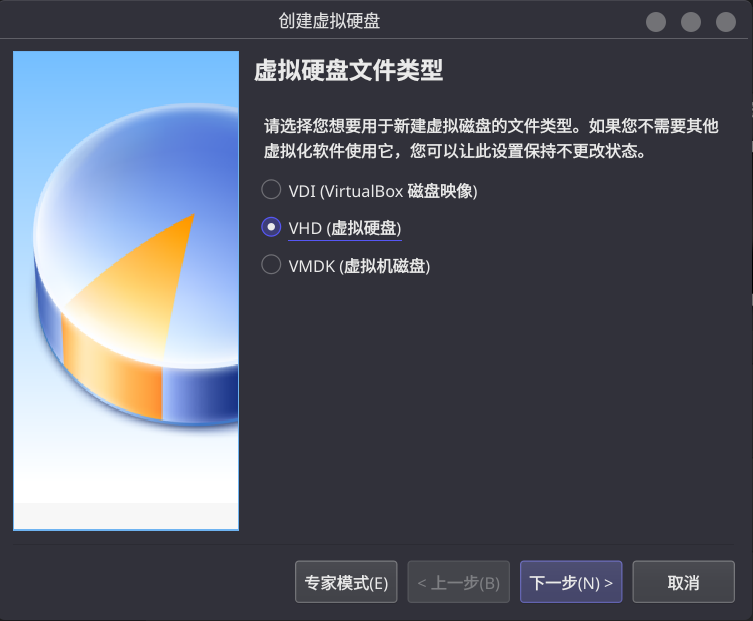
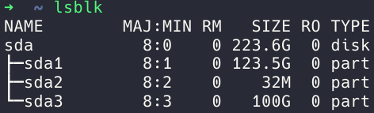
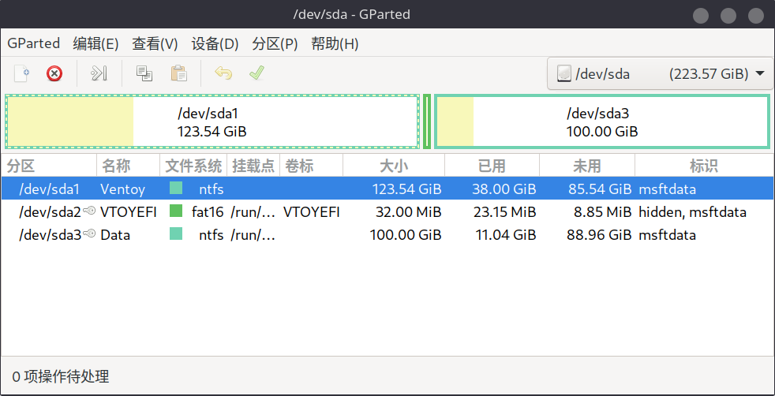
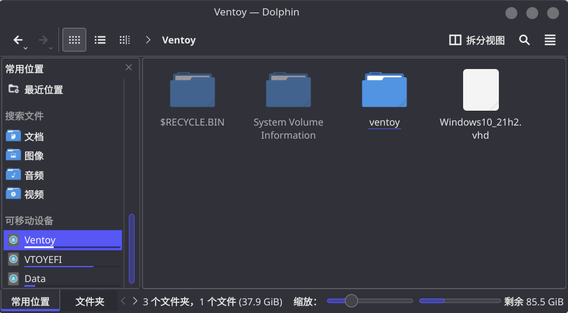
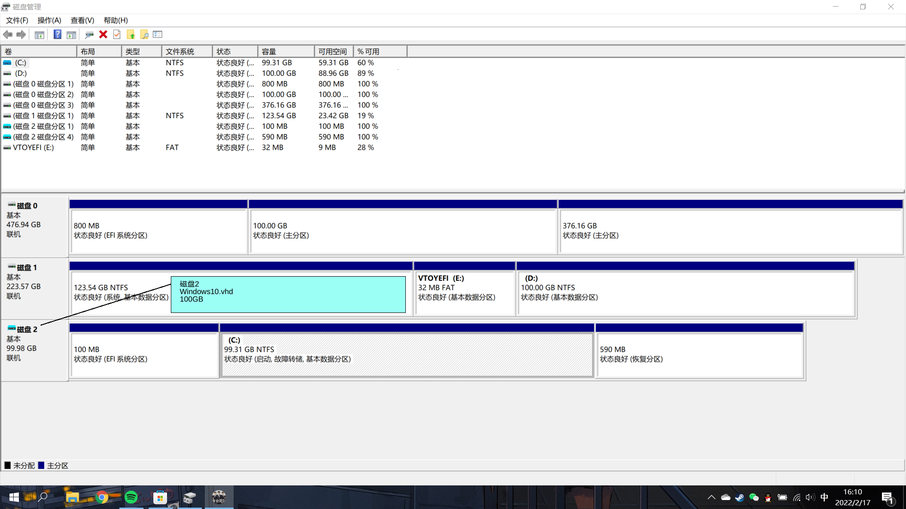

## 一、引言
家里的一台用了七八年老电脑(宏碁的一款)主板坏了没办法用，于是扒了一块256G的SSD，经过测试速度还可以，准备用来做一个Windows To Go，留作备用以及起到补全Linux生态的作用。  
说是Win To go,不过实际上只是借用了Ventory引导VHD虚拟磁盘文件的功能，但这种实现方式更具灵活性且方便管理，具体的体现有对磁盘分区的管理方式，跟便于迁移、备份等。

## 二、准备
1. SSD+硬盘盒
2. Windows10镜像:[MSDN](https://next.itellyou.cn/Original/Index)
3. VirtualBox
4. Ventoy
5. GParted
```shell
pacman -S virtualbox
yay -S ventoy-bin
pacman -S gparted
```
## 三、步骤
### (一)、通过VirtualBox安装Windows虚拟机
注意虚拟硬盘类型选择VHD，选择动态分配大小(推荐)/固定大小，分配空间不超过VHD所存放的分区的总大小。  
  
打开虚拟机设置，系统->主板->拓展特性中勾选“启用EFI”和“硬件时间使用国际标准时间(UTC)”
之后只需要正常将Windows安装完成即可

### (二)、使用Ventoy格式化可移动存储设备

1. 使用Ventory的GUI程序，检查目标是否正确  
  
2. 配置选项中将分区类型改为GPT  
3. 分区设置中设置好在磁盘最后保留一段空间，我设置了100GB  
  
4.确认无误后选择安装  
于是我们得到了一块内置Ventoy硬盘  


### (三)、使用GParted格式化分区

引导VHD格式的Windows系统需要放在NTFS文件系统的分区中，默认情况下Ventoy分区是ext4类型，我们可以直接把第一个分区(名称为Ventoy)格式化成NTFS。(注意需要先卸载才能进行格式化)  
  
顺便将之前预留的100GB格式化出第三个分区，我这里依然选择NTFS，充当Windows的数据盘(D盘)。根据自己的需求可以选择其他格式  

### (四)、安装Ventoy Windows VHD 文件启动插件
> 参考[官方文档](https://www.ventoy.net/cn/plugin_vhdboot.html)  

从[链接](https://github.com/ventoy/vhdiso/releases)中下载 ventoy_vhdboot.img 文件
把下载后的文件放在U盘第1个分区（就是放ISO文件的分区）的 ventoy 目录下（默认没有这个目录，需手动创建，注意大小写），即 /ventoy/ventoy_vhdboot.img 就可以了  

### (五)、将VHD文件放入Ventory分区
直接拷贝先前VirtualBox创建的虚拟机的VHD即可(不需要是根目录),最后差不多是这样  


### (六)、启动
将Win To Go插入电脑，进入快速启动菜单(F12),选择对应的启动设备进入Ventoy的Grub界面，之后选择对应的VHD文件启动即可进入Wiindows

### (七)、Windows下的一些配置
更新驱动、安装软件、进入磁盘管理并删除不必要的盘符

## 四、存储结构


## 五、可能出现的问题
1. Linux Windows 时间不一致(一般相差8小时),如果步骤(一)中有记得勾选“硬件时间使用国际标准时间(UTC)”的话应该不会出现这个问题不过笔者没试验过，因此把解决方法贴在这里：[Linux Windows 时间不一致](https://eason0210.github.io/post/clock-issue-with-dual-system/)