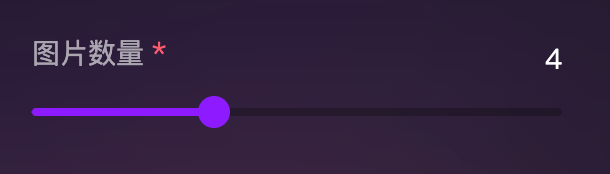

## 要求  
1. 主题色更改
2. 轨道宽度与文字对齐
3. 去除滑块的蓝色投影

原始效果：  


最终效果：  

## 知识点  
1. Less
2. 样式穿透```:deep```   
3. Ant-Design-Vue
4. 伪元素 ```::before```,```::after```
5. z-index

## 最终代码  

```less
@color-primary: #8e1aff;

.ant-slider {
    margin: 0 8px;    // 左右外间距8px，8px为滑块宽度的一半

    :deep(.ant-slider) {
        // 背景轨道
        &-rail {
            border-radius: 0;
            background: rgba(0, 0, 0, 0.25);
        }

        // 滑动条
        &-track {
            border-radius: 0;
            background-color: @color-primary;
            &:hover {
                background-color: @color-primary;
            }
        }

        // 圆形滑块
        &-handle {
            width: 16px;      // 滑块宽度     
            height: 16px;
            margin-top:-8px;    // 垂直居中显示在轨道中间
            border-radius: 50%;
            border: none;
            background-color: @color-primary;

            // 去除各状态下的阴影与外边框
            &:hover,
            &.ant-slider-handle-dragging,
            &.ant-slider-handle-click-focused,
            &.ant-tooltip-open {
                background-color: @color-primary;
                border: none;
                box-shadow: none;
            }
        }
    }

    // 创建伪元素，填补轨道前后的空缺，实现对齐
    &::after,
    &::before {
        content: '';
        width: 8px;
        height: 4px;
        background-color: #f3f3f5;
        position: absolute;
    }

    // 定位
    &::before {
        left: 0;
        background-color: @color-primary;
        transform: translateX(-100%);
        border-radius: 3px 0 0 3px;
    }
    &::after {
        right: 0;
        transform: translateX(100%);
        border-radius: 0 3px 3px 0;
        background: rgba(0, 0, 0, 0.25);
        z-index: -1;    // 使滑块能覆盖住 ::after 元素
    }
}
```