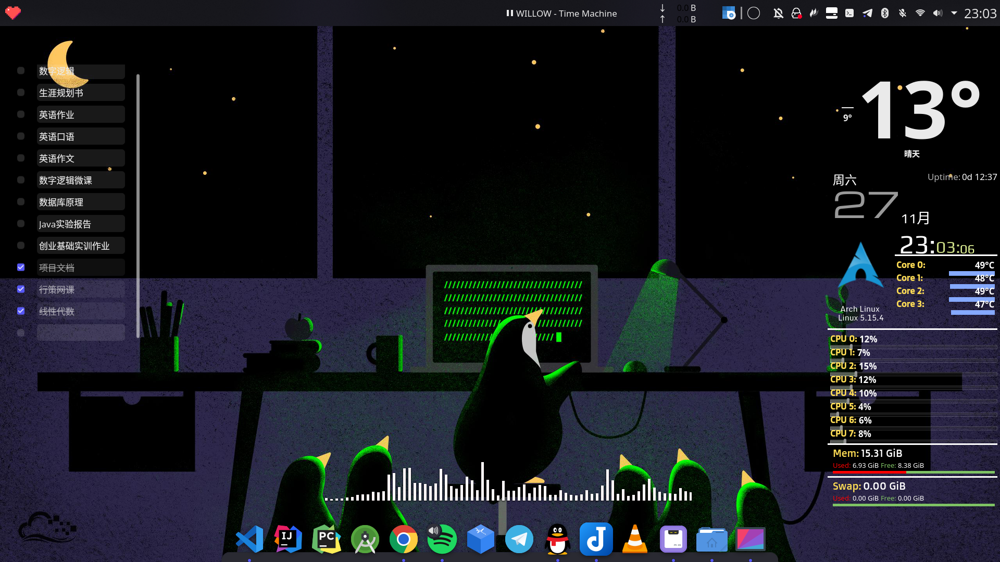

<iframe src="https://open.spotify.com/embed/track/2VMZDqV1upBSsrQPqMkvom?utm_source=generator" width="50%" height="80" frameBorder="0" allowfullscreen="" allow="autoplay; clipboard-write; encrypted-media; fullscreen; picture-in-picture"></iframe>

# 关于本网站
本网站的性质是个人博客网站
使用[Github Pages](https://docs.github.com/en/pages/getting-started-with-github-pages/about-github-pages)部署  
使用了[Vue Press](https://vuepress.vuejs.org/zh/)和[vuepress-theme-reco](https://vuepress-theme-reco.recoluan.com/)主题生成静态HTML页面  
网站源代码：[AlanCorn.github.io](https://github.com/AlanCorn/AlanCorn.github.io)
# 关于我自己
我是一名就读于杭州的大学生，专业是计算机科学与技术。  
我在大一暑假期间参与了一个基于区块链的时间银行的项目，学习了一些前端开发的技术，主要是三剑客和Vue框架  
因此我对Vue的好感让我选用VuePress而不是Hexo来构建我的个人博客  
互加友情链接请联系：AlanCorn_02@foxmail.com  

我的标签：`程序员`、`ArchLinux传教士`、`手残音游人`、`刀客塔`、`老番收割机`、`二次元`、`粳米`、`声豚`、`扳机社`

