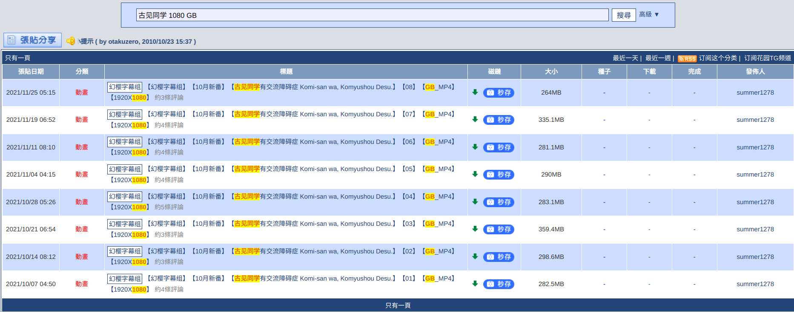
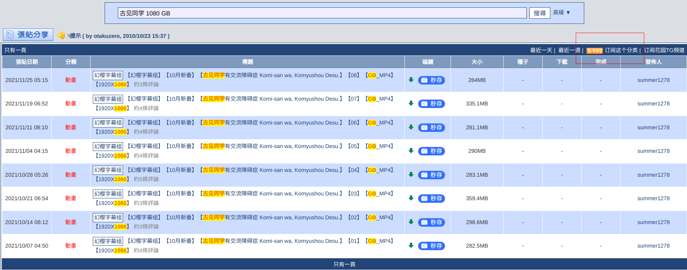
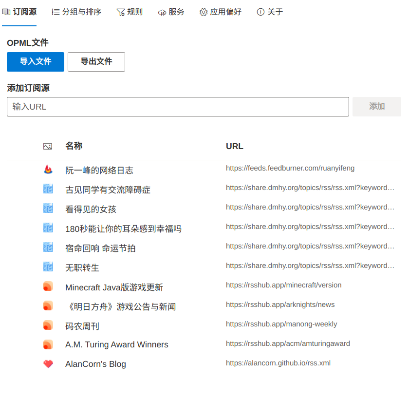
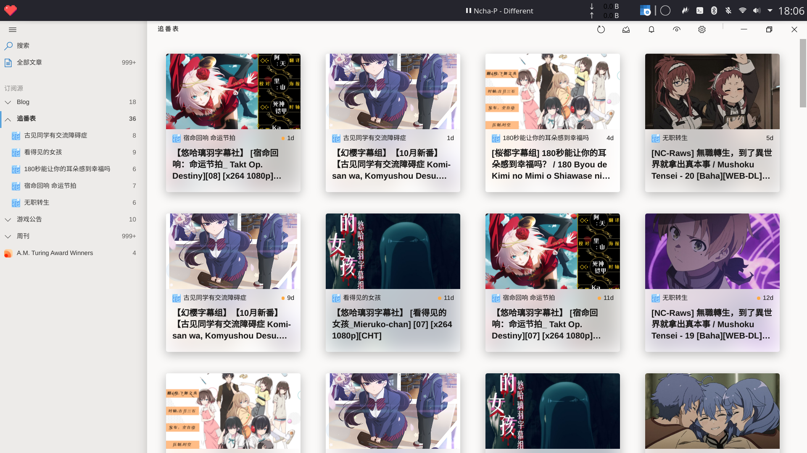
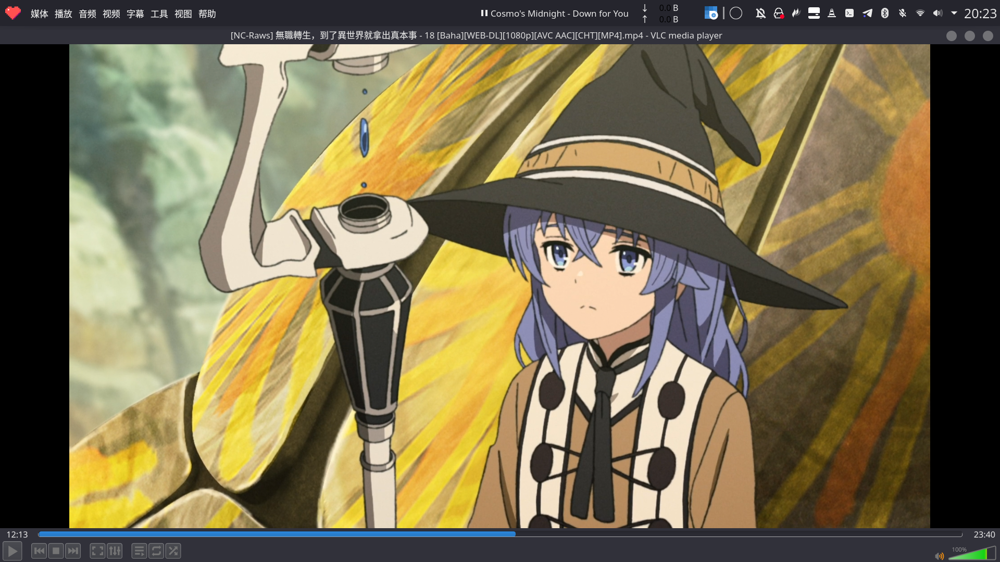

# 一、 发布站/字幕站
## 发布站
  1. [NC-Raws](https://nc.raws.dev/0:/)：种子速度快，且没被墙，缺点是搜索引擎有点拉垮，以及只有近几年的新番
  2. [Nyaa](https://nyaa.si/)：很不错的发布站，资源很全，力荐
  3. [动漫花园](https://share.dmhy.org/)：历史悠久的发布站，资源非常全，一些找不到的老番可以在这找找
  4. [萌番組](https://bangumi.moe/)：在写文档的时候才知道Bangumi也有一个发布站
  5. [Google](https://google.com/)
  6. ...
## 字幕站
  一些情况下，我们只能找到生肉资源，或者需要双语字幕/特效字幕，这时候我们可以寻找单独的字幕文件，但外挂字幕字幕轨不一定与你的画面源相吻合，这时候会出现声画与字幕不统一的问题，所以一般推荐使用发布站上字幕组直接提供的字幕
  1. [VCB-S](https://bbs.acgrip.com/)
  2. [射手网（伪）](https://assrt.net/)
  3. [FanSub](https://www.zhengmianshang.me/)
  4. [Google](https://google.com/)
  5. ...
## 其他
- 新番列表
  1. [YuC's AnimeList](https://yuc.wiki/)
  2. ...
- 番剧评分网站
  1. [Bangumi](https://bgm.tv/):国内相比于B站/豆瓣更加客观的评分网站
  2. ...  
  如果遇到片荒可以去Bangumi上的排行榜挖掘宝藏。
# 二、 善用搜索引擎
- 推荐使用关键词搜索，关键词搜索能帮助我们迅速筛选出想要的资源。  
  以下为推荐格式：`[压制组/字幕组] [动漫名(译名/罗马音)] [GB/BIG5/CHT/CHS] [4k/1080/720] [BD/DVD/Web] [外挂/内嵌]`
- 解释：
  1. 字幕组的译制版本有好有坏，还有的有双语字幕，特效字幕
  2. 对于动漫名，由于翻译版本的区别，建议缩短或者干脆使用日文罗马音搜索
  3. GB/CHS代表简中字幕，BIG5/CHT代表繁中字幕，也有直接写明简/繁字幕的
  4. 分辨率选择合适即可，一般选择1080
  5. BD/DVD/Web为压制源，BD的画质优于DVD与Web
  6. 字幕有分外挂/内嵌，外挂的意思即是字幕文件是独立与视频外的
- 其他：  
  1. Raws常指生肉，也就是未经翻译的版本，日语字幕/无字幕
  2. 不同压制组发布的版本码率不同，它们在画质、色彩上有细微差异，为追求最佳观赏体验，可以在搜索时添加偏爱的压制组关键词  
- 通过以上方法我们能迅速找到合适的搜索结果  
  优秀示范：

## 使用RSS订阅

RSS是一个让上网变得更效率的工具，，它能让你在番剧更新的时候，不必再去动漫花园(举例来说)重复输入关键词再筛选这一步骤，而是可以直接通过RSS订阅获取最新的发布信息。
1. 获取RSS订阅链接
在动漫花园检索结果的右上角部分可以找到RSS订阅链(要先使用搜索引擎完成搜索之后再)，我们右键复制链接地址

2. 添加订阅链接至RSS阅读器

自行选择支持添加订阅链接的RSS阅读器即可，我使用的是开源跨平台的[Fluent Reader](https://www.electronjs.org/apps/fluent-reader)  

# 三、关于种子下载
## 请不要使用迅雷
迅雷在种子圈早已是臭名昭著的存在，在任何情况下我都不推荐你优先考虑使用迅雷来下载任何东西。
- 参考：[迅雷有多无耻？-知乎](https://www.zhihu.com/question/377748570)
## Motrix
开箱即用的种子下载器，添加 `magnet:?xt=urn:btih:`开头的种子下载链接即可下载
## Aria2
种子下载婆罗门的存在，但配置较为复杂，不推荐普遍用户使用
- 参考：[受够了迅雷？ 一旦拥有别无他求的下载工具Motrix-知乎](https://zhuanlan.zhihu.com/p/77093612)
# 四、播放器的选择
选择支持外挂字幕，解码器新的播放器即可，以下为主观推荐
1. [VLC](https://www.videolan.org/vlc/index.zh-TW.html)
我用得最多的播放器，开源软件，跨平台

1. [MPV](https://mpv.io/)
另一款非常不错的播放器，开源软件，跨平台
3. [PotPlayer](http://potplayer.tv/?lang=zh_TW)
很多视频博主都推荐的一款播放器，不过在大陆应该是没有官方下载渠道的
4. [弹弹Play](http://www.dandanplay.com/)
可以很方便地在播放本地视频的同时加载在线/本地弹幕的播放器，可以试试，不做过多推荐，Linux下也有其替代品KikoPlayer