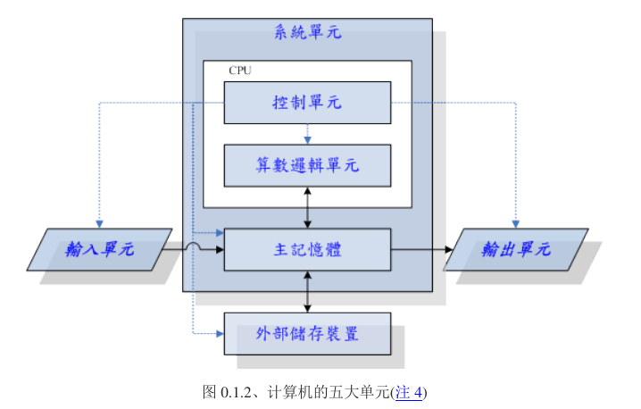
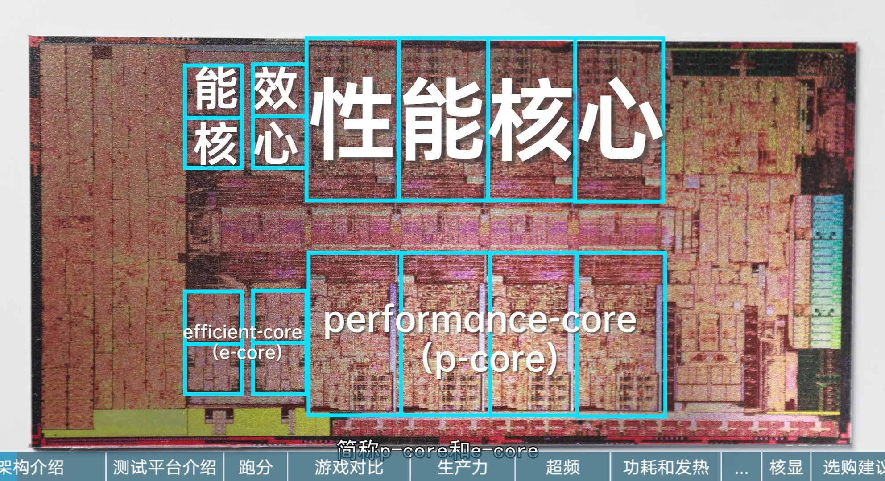
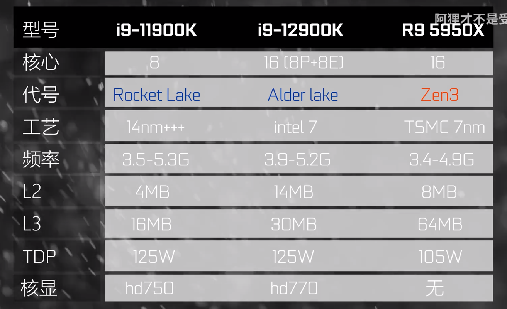

## 一、何为计算机

**计算机的定义：**是利用[数字电子技术](https://zh.wikipedia.org/wiki/数字电子技术)，根据一系列指令指示并且自动执行任意算术或逻辑操作串行的设备。通用计算机因有能遵循被称为“[程序](https://zh.wikipedia.org/wiki/计算机程序)”的一般操作集的能力而使得它们能够执行极其广泛的任务。

即只要有输入设备及输出设备，让我们可以输入数据使改机器产生信息的东西就是计算机，所以生活中很多东西其实都是计算机。

## 二、计算机硬件最重要的五大单元

**输入单元：**键盘、鼠标、触控屏、麦克风等等

**输出单元：**屏幕、打印机等

**CPU控制单元：**主要用于协调各组件与各单元间的工作

**CPU算术逻辑单元：**主要用于程序运算和逻辑判断

**主存储器（内存）：**存储CPU需要读取的数据.[^1]

[^1]: 拓展资料：[内存操作系统](https://baike.baidu.com/item/%E5%86%85%E5%AD%98%E6%93%8D%E4%BD%9C%E7%B3%BB%E7%BB%9F/2463725)，开机后将系统读取到内存中，系统完全依赖于内存和CPU运行，比较接近生活的案例是网吧
    
## 三、CPU

### **主频**

主频就是“核心速度”，显示的是当前状态下CPU的工作频率，一般来说，同架构同工艺的CPU,主频越高，运行速度越快，不同系列的CPU往往不能只通过主频高低来判断优劣(如缓存、指令集、CPU位数等都与CPU性能有关系)。

- 睿频
  在运行一个程序时，CPU自动超频到合适的频率工作
- 超频
  搞机人士追求更好的性能，压榨CPU，好处是零成本提高CPU性能，坏处是可能会导致系统运行不稳定，缩短寿命

### **核心数**

就是物理核心数，多少核就是多少核。

### **线程数**

不少CPU都有“超线程”技术，所谓超线程，就是一种提高核心利用率的方式，简而言之就是能将**一个物理核心虚拟成两个线程**。

注意：超线程只是一种提高核心利用率的技术，本质上不能代替物理核心！比如同种架构之下，4核心8线程，性能是不如6核6线程的

### **架构**

这是决定CPU性能的**最重要因素**(买新不买旧就是这个道理)，抛开架构看核心和主频是不合理的，**同一代的CPU的架构都是一样的**，不同阵营的CPU可以通过评测来了解具体的。

### **制程**

指IC内电路与电路之间的距离，一般来说，制程越先进，数值越小，比如10nm比14nm更先进。

[^2]: 64 位的个人计算机 CPU 又被统称为 x86_64 的架构
    
## 四、拓展

#### 一切设计的起点：CPU的架构

- ***精简指令集** (Reduced Instruction Set Computer, RISC):*

这种 CPU 的设计中,微指令集较为精简,每个指令的运行时间都很短,完成的动作也很单纯,指令
的执行效能较佳; 但是若要做复杂的事情,就要由多个指令来完成。

**ARM架构：**由于其功耗相比x86低，广泛应用于各种手机和(小型)移动设备使用的CPU，苹果公司的M1系列芯片等。

- ***复杂指令集**(Complex Instruction Set Computer, CISC):*

复杂指令集在微指令集的每个小指令可以执行一些较低阶的硬件操作,指令数目多而且复杂, 每条指令的长度并不相同。因为指令执行较为复杂所以每条指令花费的时间较长, 但每条指令可以处理的工作较为丰富。

**x86架构/x86_64.[^2]：**兼容性好广泛用于个人计算机的CPU架构

#### x86与ARM区别

1. 性能：如果是在10年前，ARM架构的芯片是无论如何都是比不过x86架构的，但如今intel的常年挤牙膏行为，ARM架构的芯片的性能也在不断追赶甚至赶超x86架构的芯片
2. 拓展能力：x86一直有着ARM无可比拟的拓展能力，x86由于通过“桥”连接显卡、内存、硬盘，便于进行更换和维修，通常具有更长的使用周期。ARM通过专用的数据接口与数据存储设备进行连接，一般在产品设计时就确定好内存和存储。
3. 操作系统兼容性：

   x86：可以装Windows，Linux，~~黑苹果~~

   ARM：苹果手机装安卓~~或者安卓手机装苹果~~？我看不行
4. 软件开发的方便性及可使用工具的多样性

   容器、版本控制工具、文本编辑器、集成开发环境、文本比较工具
5. 功耗：ARM比x86低
