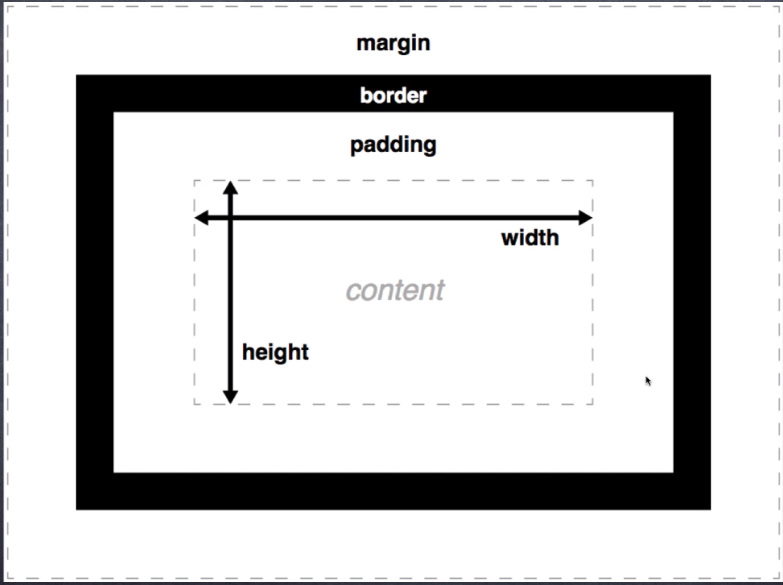

## 语法

elector {property: value}
选择器{属性:值}

## 选择器

1. 元素选择器
    如

    ```css
    div {property: value} 
    ```

2. 类选择器

    ```css
    .box {property: value}
    ```

    ```html
    <div class="box">
        ...
    </div>
    ```

3. ID选择器

    ```css
    #para1 {property: value} 
    ```

    ```html
    <p id="para1">
        ...
    </p>
    ```

## 常用颜色

背景：#f4f4f4
字体颜色：#555555

## 盒子模型



## CSS边框

边框属性：
* border-radius
* box-shadow
* border-image

## 定位

### 静态定位

### 相对定位

### 绝对定位

### 固定定位
