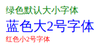
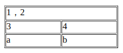
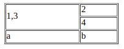
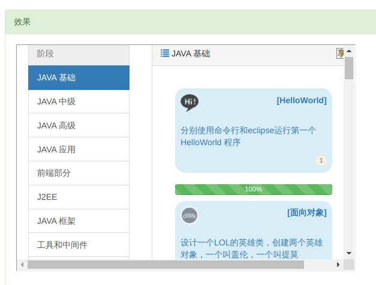

# HTML5学习笔记

HTML 是用来描述网页的一种语言。

* HTML 指的是超文本标记语言 (Hyper Text Markup Language)
* HTML 不是一种编程语言，而是一种标记语言 (markup language)
* 标记语言是一套标记标签 (markup tag)
* HTML 使用标记标签来描述网页

## 标签

### 网页标题

```html
<head>

</head>
```

### 正文标签

```html
<body>

</body>
```

#### background属性

```html
<body background="/.../background.jpg">
```

### 标题标签

```html
<h1>Heading one</h1>
<h2>Heading two</h2>
<h3>Heading three</h3>
```

* 浏览器会自动地在标题的前后添加空行。
* 默认情况下，HTML会自动地在块级元素前后添加一个额外的空行，比如段落、标题元素前后。
* 标题很重要，因为搜索引擎使用标题为您的网页的结构和内容编制索引。

### 水平线标签

```html
<hr /> 标签在 HTML 页面中创建水平线。
```

产生一个水平线,多用于分隔

### 段落标签

```html
<p>lorem20</p>
```

不要使用空的段落标记\<p></p>去插入一个空行，请使用\<br /> 标签换行

### 换行标签

```html
<br />标签换行
```

\<br />在段落中使用可以不产生新段落并且换行
\<br>和\<br />都能换行但\<br />更好

### 超链接标签

```html
<a href="google.com">This is a link</a>
<!-- 没有下划线的链接 -->
<a href="/html/example.html" style="text-decoration:none">This is a link</a>
```

#### 图片超链接

将\标签包括在\<a>中可以实现图片超链接

#### 超链接中的target属性

可以定义被链接的文档在何处显示

```html
<!-- target="_blank"在新窗口打开 -->
<a href="/html/example.html" target="_blank">This is a link</a>
<!-- 使用target="_top"属性跳出框架 -->
<a href="/index.html" target="_top">click</a>
```

#### 超链接中的name属性

命名锚(传送锚点???),可以用来实现书签功能
使用方法：

1. 首先，我们在 HTML 文档中对锚进行命名（创建一个书签）：\<a name="word">文字</a>
2. 然后，我们在同一个页面中创建指向该锚的链接：\<a href="word">文字</a>
3. 我们也可以在其他页面中创建指向该锚的链接：\<a href="http://www.example.com/html.asp#word">w文字</a>

### 图像标签

```html

```

可以插入到段落中

### 粗体标签

```html
<b> 
<strong>    
```

### 斜体标签

```html
<i>
<em>
```

### 字体标签

```html
<font color="green">绿色默认大小字体</font>
<br>
<font color="blue" size="+2">蓝色大2号字体</font>
<br>
<font color="red" size="-2">红色小2号字体</font>
<font color="red" >用red表示红色字体</font>
<br>
<font color="#ff0000" >用#ff0000表示红色字体</font>
```

**效果**


### 删除线效果

```html
<del>使用del标签实现的删除效果</del>
<s>使用s标签实现的删除效果，但是不建议使用，因为很多浏览器不支持s标签</s>
```

### 下划线效果

```html
<ins>使用ins标签实现的下划线效果</ins>
<u>使用u标签实现的下划线效果，但是不建议使用</u>
```

### 预格式

```html
<pre>
可以让源文件中的回车正常显示
public class HelloWorld {
 
    public static void main(String[] args) {
        System.out.println("Hello World");
    }
}
</pre>
```

### 表格

\<table></table>

```html
<table>
        <thead>                 
            <tr>           
                <th>name</th>
                <th>age</th>
                <th>E-mail</th>
            </tr>
        </thead>
        <tbody>
            <tr>
                <td>alan</td>
                <td>19</td>
                <td>alan@123</td>
            </tr>
        </tbody>
    </table>
```

#### border属性

可以给表格添加边框

```html
<table border="1">
  <tr>
      <td>1</td>
      <td>2</td>
  </tr>
  <tr>
      <td>3</td>
      <td>4</td>
  </tr>
  <tr>
      <td>a</td>
      <td>b</td>
  </tr>
</table>
```

#### width属性

设置宽度

```html
<table border="1" width="200px">

</table>
```

#### td的属性colspan

```html
<table border="1" width="200px">
    <tr>
        <td colspan="2" >1，2</td>
    </tr>
    <tr>
        <td>3</td>
        <td>4</td>
    </tr>
    <tr>
        <td>a</td>
        <td>b</td>
    </tr>
</table>
```

**效果**  


#### td的属性rowspan

```html
<table border="1" width="200px">
    <tr>
        <td rowspan="2">1,3</td>
        <td>2</td>
    </tr>
    <tr>
        <td>4</td>
    </tr>
    <tr>
        <td>a</td>
        <td>b</td>
    </tr>
</table>
```

**效果**  


### 列表

```html
<!-- unordered list -->
<ul>    
    <li>list item 1</li>
    <li>list item 2</li>
    <li>list item 3</li>
    <li>list item 4</li>
</ul>
<!-- ordered list -->
<ol>
    <li>list item 1</li>
    <li>list item 2</li>
    <li>list item 3</li>
</ol>
```

### 自定义列表

自定义列表以\<dl> 标签开始。每个自定义列表项以\<dt> 开始。每个自定义列表项的定义以\<dd>开始。

```html
<dl>
<dt>Coffee</dt>
<dd>Black hot drink</dd>
<dt>Milk</dt>
<dd>White cold drink</dd>
</dl>
```

### 内联框架

**iframe**相当于浏览器里面有个小浏览器，在这个小浏览器中，打开另一个网页

```html
<iframe src="https://how2j.cn/" width="600px" height="400px">
</iframe>
```

**效果**  


## 块元素与内联元素

**块元素**：块级元素在浏览器显示时，通常会以新行来开始（和结束）。如h1,table,p等
**内联元素**：内联元素在显示时通常不会以新行开始。如img,a,b,strong等

## div 与 span 元素

\<div>元素是**块级元素**，它是可用于组合其他 HTML 元素的容器，没有特定的含义。
\<span>元素是**内联元素**，可用作文本的容器。没有特定的含义。

### div

```html
<div style="margin-left:100px" >
 
  <br/>
 
</div>
```

## 表单

```html
<!-- 将提交的数据存入form.js, 一般使用POST -->
<form action="form.js" method="POST">
    <div>
        <label>first name</label>
        <input type="text" name="name" placeholder="Enter your name">
    </div>
</form>
```

### 文本域与密码域

```html
<form>
用户：
<input type="text" name="user" placeholder="用户">
<br />
密码：
<input type="password" name="password" placeholder="密码">
</form>
<p>
请注意，当您在密码域中键入字符时，浏览器将使用项目符号来代替这些字符。
</p>
```

## 特性或规则

### 连续的空格显示为一个空格

当显示页面时，浏览器会移除源代码中多余的空格和空行。所有连续的空格或空行都会被算作一个空格。

### 属性值必须加引号

## 使用样式

### 外部样式

当样式需要被应用到很多页面的时候，外部样式表将是理想的选择。使用外部样式表，你就可以通过更改一个文件来改变整个站点的外观。

```html
<head>
<link rel="stylesheet" type="text/css" href="mystyle.css">
</head>
```

### 内部样式

当单个文件需要特别样式时，就可以使用内部样式表。你可以在head部分通过\<style>标签定义内部样式表。

```html
<head>
<style type="text/css">
body {background-color: red}
p {margin-left: 20px}
</style>
</head>
```

### 内联样式

当特殊的样式需要应用到个别元素时，就可以使用内联样式。 使用内联样式的方法是在相关的标签中使用样式属性。样式属性可以包含任何 CSS 属性。以下实例显示出如何改变段落的颜色和左外边距。

```html
<p style="color: red; margin-left: 20px">
This is a paragraph
</p>
```

## 修改显示编码

```html
<meta http-equiv="Content-Type" content="text/html; charset=UTF-8" />
<meta http-equiv="Content-Type" content="text/html; charset=GB2312" />
```
